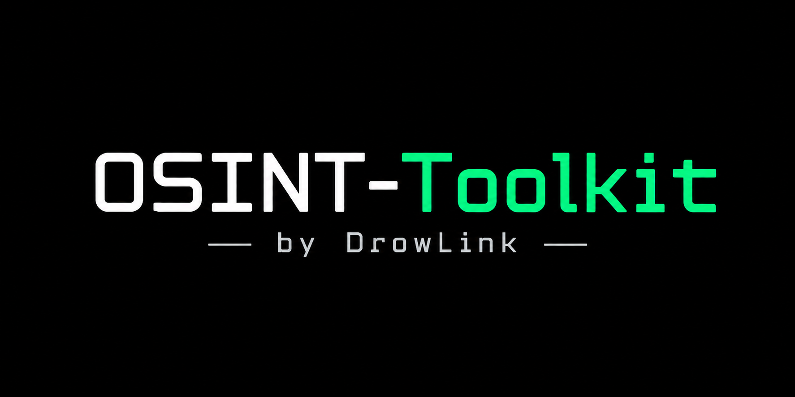
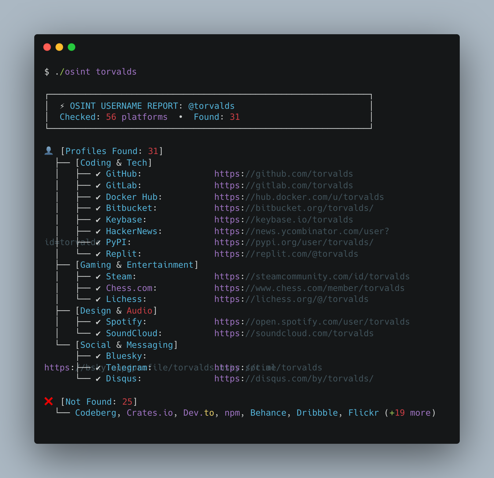

<p align="center">
  <br>
  <a href="https://github.com/DrowLink/osint-toolkit" target="_blank">
    
  </a>
  <br>
  <br>
  <b>A fast, dependency-free Python CLI for passive domain infrastructure intelligence and multi-platform username hunting.</b>
  <br>
  <span>Hunt down infrastructure metadata, email anti-spoofing configurations, and user accounts across public platforms.</span>
  <br>
</p>

<p align="center">
  <a href="https://drowlink.github.io/osint-toolkit/" target="_blank"><b>Documentation Site</b></a>
  &nbsp;&nbsp;&nbsp;•&nbsp;&nbsp;&nbsp;
  <a href="#installation">Installation</a>
  &nbsp;&nbsp;&nbsp;•&nbsp;&nbsp;&nbsp;
  <a href="#general-usage">Usage</a>
  &nbsp;&nbsp;&nbsp;•&nbsp;&nbsp;&nbsp;
  <a href="#what-it-collects">Features</a>
  &nbsp;&nbsp;&nbsp;•&nbsp;&nbsp;&nbsp;
  <a href="SPECS.md">Specs</a>
  &nbsp;&nbsp;&nbsp;•&nbsp;&nbsp;&nbsp;
  <a href="#contributing">Contributing</a>
  &nbsp;&nbsp;&nbsp;•&nbsp;&nbsp;&nbsp;
  <a href="#license">License</a>
</p>

<p align="center">
  
  
  
  
</p>

<p align="center">
  
</p>

---

## Key Highlights

- ⚡ **Zero External Dependencies**: Built 100% on Python's standard library (`urllib`, `socket`, `ssl`, `concurrent.futures`).
- 🛡️ **Strictly Passive & Bounded**: No port scans, no brute forcing, and no invasive probing.
- 🚀 **High Concurrency**: Multi-threaded execution inspects dozens of platforms and records in seconds.
- 🖥️ **Modern Terminal UI**: Sleek UTF-8 tree hierarchy formatting with colors and status badges.
- 📁 **Dual Output**: Terminal summary cards or reproducible, structured JSON exports (`-o`).

---

## Installation

| Method | Command | Notes |
| :--- | :--- | :--- |
| **Direct Run** *(No install)* | `./osint <target>` or `python3 -m osint_toolkit <target>` | Works immediately on any system with Python 3.11+ |
| **CLI Command** | `pip install .` | Installs global `osint`, `search-shodan`, `search-virustotal`, etc. |
| **Docker** | `docker run -it --rm osint-toolkit <target>` | Portable container execution |

```bash
# Clone the repository
git clone https://github.com/DrowLink/osint-toolkit.git
cd osint-toolkit

# Run directly without flags!
./osint torvalds
```

---

## General Usage

`osint-toolkit` automatically detects whether your target is a **username** or a **domain**, and defaults to a clean, formatted terminal UI:

### 1. Username Hunting Mode (Sherlock Style)

Just pass any username or `@handle`. It searches concurrently across 20+ public platforms:

```bash
# Search a username (auto-detected)
./osint torvalds

# Or using python module
python3 -m osint_toolkit torvalds

# Save findings to a JSON file while viewing terminal output
./osint torvalds -o torvalds.json

# Output pure JSON (for scripting / piping)
./osint torvalds -j
```

### 2. Domain Reconnaissance Mode

Pass any domain name to analyze DNS, email security, WHOIS/RDAP, certificates, and headers:

```bash
# Analyze domain infrastructure (auto-detected)
./osint github.com

# Save complete JSON audit to file
./osint github.com -o github.json

# Output pure JSON
./osint github.com -j
```

### 3. Specialized Threat & Intel Services

Run standalone commands or subcommands for deep external intelligence:

```bash
# Shodan (zero-auth via InternetDB, or SHODAN_API_KEY)
./osint shodan 8.8.8.8
./search_shodan github.com

# IP2Location (zero-auth public tier, or IP2LOCATION_API_KEY)
./osint ip2location 8.8.8.8
./search_ip2location 1.1.1.1

# VirusTotal (with VIRUSTOTAL_API_KEY or guided unauthenticated mode)
./osint virustotal google.com
./search_virustotal 8.8.8.8

# Censys (with CENSYS_API_ID / CENSYS_API_SECRET)
./osint censys 8.8.8.8
./search_censys google.com
```

### 4. Python Library Usage

All engines are directly importable as pure Python functions:

```python
from osint_toolkit import (
    search_username,
    collect_report,
    search_shodan,
    search_ip2location,
    search_virustotal,
    search_censys,
)

# Search usernames
profiles = search_username("torvalds")

# Shodan host intelligence
shodan_info = search_shodan("8.8.8.8")

# Geolocation & ASN
geo = search_ip2location("8.8.8.8")
```

---

## What It Collects

### Domain Mode
- **DNS & Nameservers**: Public IPv4 & IPv6 addresses, authoritative nameservers (NS), and SOA primary server/administrator contact.
- **Email & Anti-Spoofing**: MX servers with provider identification (*Google Workspace, Microsoft 365, Proton, etc.*), SPF mechanism strength evaluation, and DMARC enforcement policy (`reject`, `quarantine`, `none`).
- **Domain Registration (RDAP / WHOIS)**: Official registrar, registration/expiration dates, and EPP domain statuses.
- **IP Infrastructure & Geolocation**: Public IP ASN, ISP organization, country, region, and city.
- **Subdomains**: Historical subdomain discovery via Certificate Transparency (crt.sh) logs.
- **Web & Security Headers**: HTTP status, page title, server banner, cookie security flags (`Secure`, `HttpOnly`, `SameSite`), and defensive headers (*HSTS, CSP, COOP, COEP, etc.*).
- **TLS Certificate**: Subject, issuer, cipher suite, protocol, expiry, days remaining, and Subject Alternative Names (SANs).
- **Public Policy Files**: Presence, contacts, and sitemaps in `/.well-known/security.txt` and `/robots.txt`.

### Username Mode
- **Coding & Tech**: GitHub, Codeberg, Docker Hub, Dev.to, Keybase, HackerNews, Replit, Pastebin.
- **Social & Messaging**: Telegram, Disqus, Linktree, Gravatar.
- **Gaming & Chess**: Steam, Chess.com, Lichess, itch.io.
- **Design & Audio**: Behance, Dribbble, Flickr, SoundCloud.
- **Knowledge & Publishing**: Substack, Wikipedia *(with sockpuppet/blocked account detection)*, Instructables.

---

## CLI Options

```console
$ ./osint --help
usage: osint-toolkit [-h] [-u USERNAME] [-d DOMAIN] [-t TIMEOUT] [-o OUTPUT]
                     [-j] [-s] [target]

Fast, dependency-free OSINT toolkit for domains and usernames.

positional arguments:
  target                Target domain (e.g. google.com) or username (e.g. drowlink)

options:
  -h, --help            Show this help message and exit
  -u, --username USER   Explicitly search username across public platforms
  -d, --domain DOMAIN   Explicitly analyze domain infrastructure
  -t, --timeout SECS    Operation deadline in seconds (default: 8.0)
  -o, --output FILE     Path to write JSON report output (default: stdout)
  -j, --json            Output raw JSON instead of human-readable summary
  -s, --summary         Display human-readable summary card (default in terminal)
```

---

## Safety Properties

- Rejects IP literals, custom ports, local names, and non-public-unicast DNS answers.
- Pins outbound HTTP/TLS connections to prevalidated public IPv4 addresses only.
- Limits each response body to 256 KiB; large payloads are safely truncated while preserving headers.
- Bounds initial lookups with monotonic per-operation deadlines in daemon threads.
- Strictly uses Python's standard library with zero third-party dependencies.

---

## Tests

Run the complete test suite (54 unit tests covering domain collectors, DNS parsers, CLI, and username search):

```bash
python3 -m unittest discover -s tests -v
```

---

## Responsible Use

Use this tool only for lawful research involving public internet resources. Follow applicable laws, site terms of service, and organizational policies. Keep request volume low and obtain authorization before transitioning from passive reconnaissance to active security testing.

---

## Contributing

Contributions, bug reports, and site additions are welcome! Please check [CONTRIBUTING.md](CONTRIBUTING.md) for guidelines.

---

## License

[MIT](LICENSE) © DrowLink
